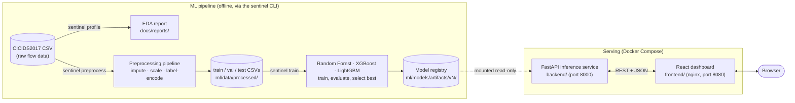

# SentinelML


**An end-to-end network intrusion detection platform** — from raw packet-capture
flow data to a served, monitored, dashboarded machine learning model. Built on
the [CICIDS2017](https://www.unb.ca/cic/datasets/ids-2017.html) dataset, it
takes you through data profiling, leak-free preprocessing, multi-model
training and selection, a FastAPI inference service, and a React dashboard —
all reproducible with one CLI (`sentinel`) and deployable with one command
(`docker compose up`).

## Table of contents

- [Overview](#overview)
- [Architecture](#architecture)
- [Dataset](#dataset)
- [Tech stack](#tech-stack)
- [Installation](#installation)
- [API usage](#api-usage)
- [Dashboard](#dashboard)
- [Model performance](#model-performance)
- [Deployment](#deployment)
- [Project structure](#project-structure)
- [Future improvements](#future-improvements)

## Overview

SentinelML classifies network flows into `BENIGN` traffic or one of five
attack types (`DoS Hulk`, `DoS GoldenEye`, `DoS Slowhttptest`,
`DoS slowloris`, `Heartbleed`) using flow-level statistics — packet counts,
inter-arrival times, flag counts, window sizes — rather than raw packet
contents. It's built as seven milestones, each a complete, independently
runnable stage:

| # | Milestone | What it does |
|---|---|---|
| 1 | **Data profiling** | Explores the raw CSV: missing/infinite values, duplicates, class imbalance, correlated features. `ml/data/`, [`docs/reports/`](docs/reports/data_profile_report.md) |
| 2 | **Preprocessing** | Deduplicates, stratified-splits, drops constant/low-variance columns, imputes, scales, label-encodes — fit only on the training split. `ml/preprocessing/` |
| 3 | **Training** | Trains Random Forest, XGBoost, and LightGBM with class-balanced sample weights; evaluates all three; selects and persists the best. `ml/training/`, `ml/evaluation/` |
| 4 | **Inference API** | FastAPI service loading the trained model + preprocessing pipeline; health/readiness/metadata/prediction endpoints. `backend/` |
| 5 | **Dashboard** | React app for exploring model performance and making single/batch predictions against the live API. `frontend/` |
| 6 | **Productionization** | Docker images, Compose stack, CI, and this README. |
| 7 | **Production deployment** | Public deployment to Render (backend) + Vercel (frontend). [`render.yaml`](render.yaml), [`frontend/vercel.json`](frontend/vercel.json), [`scripts/verify_deploy.sh`](scripts/verify_deploy.sh). *(you are here)* |

Every stage has its own README with the full detail: [`ml/data/README.md`](ml/data/README.md),
[`ml/preprocessing/README.md`](ml/preprocessing/README.md),
[`ml/training/README.md`](ml/training/README.md),
[`ml/inference/README.md`](ml/inference/README.md),
[`backend/README.md`](backend/README.md), [`frontend/README.md`](frontend/README.md).

## Architecture



Two things worth calling out:

- **The preprocessing pipeline is fit once (Milestone 2) and only ever
  *loaded*, never refit** — by training (Milestone 3) or by the inference
  API (Milestone 4). This is what prevents train/serve skew: the exact
  imputer, scaler, and label encoder that produced the training data are
  the ones applied to every prediction request.
- **The dashboard never talks to the ML pipeline directly.** It only calls
  the FastAPI service's REST endpoints, and the backend only imports
  `ml.inference.Predictor` — never scikit-learn/XGBoost/LightGBM or the
  preprocessing/training internals directly. Swapping the winning model
  type or retraining never requires a backend or frontend code change.

## Dataset

[**CICIDS2017**](https://www.unb.ca/cic/datasets/ids-2017.html) (Canadian
Institute for Cybersecurity, University of New Brunswick) — labeled network
flow data generated from real, benign background traffic plus common
attacks, with 78 flow-level features extracted via CICFlowMeter. This
project uses the `Wednesday-workingHours` capture (DoS/Heartbleed attacks):

- **692,703 rows**, 79 columns (78 features + `Label`)
- **11.8% exact duplicate rows** (81,909) — removed before splitting
- **6 classes, heavily imbalanced**: `BENIGN` (440,031) and `DoS Hulk`
  (231,073) dominate; `Heartbleed` has just **11 rows total**
- Known data quality issues (see the full [EDA report](docs/reports/data_profile_report.md)):
  infinite values in rate-derived columns (`Flow Bytes/s`, `Flow Packets/s`,
  division-by-zero on zero-duration flows), 10 constant columns, 37
  low-variance columns, 87 highly-correlated feature pairs

The dataset itself is **not** included in this repository (see
[`ml/data/README.md`](ml/data/README.md) for the official download link) —
`ml/data/raw/` and `ml/data/processed/` are gitignored and regenerated
locally by the pipeline. `ml/models/artifacts/` (the already-trained model
+ preprocessing pipeline) **is** committed, so the API/dashboard/Docker
Compose stack all work out of the box without rerunning the pipeline — see
[Deployment](#deployment).

## Tech stack

| Layer | Technology |
|---|---|
| ML pipeline | Python 3.12, [uv](https://docs.astral.sh/uv/), pandas, scikit-learn, XGBoost, LightGBM, matplotlib/seaborn |
| Inference API | FastAPI, Pydantic v2, Uvicorn, pydantic-settings |
| Dashboard | React 19, TypeScript, Vite, Tailwind CSS v4, TanStack Query, React Router, Recharts |
| Testing | pytest (155 tests), Vitest + Testing Library (38 tests) |
| Packaging & CI | Docker (multi-stage builds), Docker Compose, GitHub Actions |

## Installation

### Quickest path: Docker Compose

Serves the dashboard and API together. Requires Docker.

```bash
git clone https://github.com/sankhepiu/SentinelML.git
cd SentinelML
docker compose up --build
```

Open **http://localhost:8080**. `ml/models/artifacts/` is committed to this
repo (see [Deployment](#deployment)), so `/api/v1/ready` reports `200` and
the dashboard is fully usable right out of a fresh clone — no need to run
the ML pipeline first. Retrain locally (native setup below) to replace it
with your own version; Compose mounts `ml/models/artifacts/` read-only from
the host, so a rebuild isn't needed after retraining, just a restart.

### Full local development setup

Needed to actually run the ML pipeline (download data, profile, preprocess,
train) — Docker only *serves* an already-trained model.

**Prerequisites:** Python 3.12, [uv](https://docs.astral.sh/uv/), Node.js 22.

```bash
git clone https://github.com/sankhepiu/SentinelML.git
cd SentinelML

# Python (ml/ + backend/, one shared virtualenv via uv workspaces)
uv sync --all-packages

# Frontend
cd frontend && npm install && cd ..
```

Then run the pipeline (see each milestone's README for details and options):

```bash
# 1. Download the CICIDS2017 Wednesday CSV per ml/data/README.md, place at
#    ml/data/raw/Wednesday-workingHours.pcap_ISCX.csv, then:
uv run sentinel profile --input ml/data/raw/Wednesday-workingHours.pcap_ISCX.csv
uv run sentinel preprocess --input ml/data/raw/Wednesday-workingHours.pcap_ISCX.csv
uv run sentinel train

# Serve the API + dashboard
uv run sentinel serve          # http://localhost:8000
cd frontend && npm run dev     # http://localhost:5173 (proxies /api to :8000)
```

### Running the tests

```bash
uv run pytest                        # ml/ + backend/, 155 tests
cd frontend && npm run test          # 38 tests
```

CI (`.github/workflows/ci.yml`) runs all of this on every push: Python
lint + test, frontend lint + test + build, a live backend process
verification (starts the real `sentinel serve` process and checks
`/health`/`/ready`/OpenAPI), and a full Docker Compose build + smoke test.

## API usage

Full reference, request/response examples, error handling, and logging
details: [`backend/README.md`](backend/README.md). Interactive docs at
`/docs` once the server is running (OpenAPI schema at `/openapi.json`).

| method | path | purpose |
|---|---|---|
| GET | `/api/v1/health` | Process is alive |
| GET | `/api/v1/ready` | Model is loaded and usable (200/503) |
| GET | `/api/v1/model` | Model type, version, features, classes, metrics |
| GET | `/api/v1/model/training-summary` | Full candidate-model comparison, confusion matrices, feature importances |
| POST | `/api/v1/predict` | Predict one flow's class |
| POST | `/api/v1/predict/batch` | Predict a batch of flows |

```bash
curl http://localhost:8000/api/v1/model

curl -X POST http://localhost:8000/api/v1/predict \
  -H "Content-Type: application/json" \
  -d '{"features": {"Destination Port": 443, "Flow Duration": 84852, "...": "... every feature GET /api/v1/model lists"}}'
```

```json
{
  "predicted_class": "BENIGN",
  "confidence": 0.98,
  "class_probabilities": { "BENIGN": 0.98, "DoS Hulk": 0.01, "...": "..." },
  "model_version": "v2"
}
```

The exact required feature set is dynamic (whichever columns preprocessing
kept for the currently loaded model) — `GET /api/v1/model` is the
authoritative source; an incomplete or extra-keyed payload returns `422`
naming exactly what's wrong.

## Dashboard

Five pages — Overview, Model Information, Single Prediction, Batch
Prediction (CSV upload), and Prediction History — all built on
`GET /api/v1/model`, `/model/training-summary`, `/predict`, and
`/predict/batch`. Full page-by-page description:
[`frontend/README.md`](frontend/README.md#pages).

<!--
  Screenshots pending -- capture each page at ~1440px width and drop the
  files in docs/screenshots/, then uncomment below. Suggested shots:
  overview.png (status badges + class distribution), model-info.png
  (candidate comparison + confusion matrix), single-prediction.png (form +
  result card), batch-prediction.png (upload + results table),
  history.png (logged predictions).

  ### Overview
  

  ### Model Information
  

  ### Single Prediction
  

  ### Batch Prediction
  

  ### Prediction History
  
-->

## Model performance

Trained on the CICIDS2017 Wednesday split: 427,555 train / 91,619
validation / 91,620 test rows (70/15/15, stratified, post-deduplication),
30 features after dropping constant and low-variance columns, class-balanced
sample weights to counter the extreme imbalance (`BENIGN` is ~40,000x
`Heartbleed`'s row count).

Validation-split comparison across all three candidates (model selection
uses `f1_macro`, precisely because it weights every class equally
regardless of support — unlike accuracy, which a model could game by
ignoring rare attack types):

| Model | Accuracy | Precision (macro) | Recall (macro) | F1 (macro) | ROC-AUC (OvR macro) |
|---|---|---|---|---|---|
| Random Forest | 0.9994 | 0.9971 | 0.9978 | 0.9974 | 0.9997 |
| XGBoost | 0.9995 | 0.9952 | 0.9987 | 0.9969 | 0.9999 |
| **LightGBM** (selected) | **0.9996** | **0.9978** | **0.9987** | **0.9982** | **0.9999** |

The selected model's held-out **test**-split result (the number that
actually matters — validation drove model *selection*, this is the
unbiased check): **accuracy 0.9997, F1 (macro) 0.9976, ROC-AUC 0.99999**.
Full per-class precision/recall/F1, the confusion matrix, and every
candidate's feature importances are in
`ml/models/artifacts/<version>/training_summary.json` and served live at
`GET /api/v1/model/training-summary` (see the Model Information dashboard
page). Methodology, imbalance handling, and versioning:
[`ml/training/README.md`](ml/training/README.md).

*(These are real numbers from a real trained model in this repo, not
illustrative placeholders — reproduce them with `uv run sentinel train`
after preprocessing, same seed (`--random-state 42`, the default).)*

## Deployment

`ml/models/artifacts/` (the trained model + preprocessing pipeline) is
committed to this repo specifically so every option below is
self-contained — no volume mount or object-storage fetch step needed to
have a working deployment. Retrain and commit a new version
(`ml/models/artifacts/vN/`) to update the served model.

### Production: Render (backend) + Vercel (frontend)

This is the reference deployment (Milestone 7) and the simplest path to a
publicly reachable URL — no server to manage, both platforms build
straight from this GitHub repo on every push to `main`.

**1. Backend → Render**

- [New Blueprint Instance](https://dashboard.render.com/select-repo?type=blueprint)
  → pick this repo. Render reads [`render.yaml`](render.yaml) and creates
  a `sentinelml-backend` web service: Docker runtime, build context repo
  root, `backend/Dockerfile`, health check at `/api/v1/health`.
- Render injects `$PORT` automatically; the backend Dockerfile's `CMD`
  reads it (`uvicorn ... --port ${PORT:-8000}`) — nothing to configure.
- `render.yaml` also sets `SENTINELML_CORS_ALLOW_ORIGIN_REGEX` to
  `^https://sentinelml.*\.vercel\.app$`, which matches both the
  production Vercel domain and every per-branch preview deployment for a
  Vercel project named `sentinelml`. **If you name the Vercel project
  something else, edit that regex before deploying** (or add the exact
  production URL to `SENTINELML_CORS_ALLOW_ORIGINS` in the Render
  dashboard once you have it — see [`backend/.env.example`](backend/.env.example)).
- First deploy takes a few minutes (installs `build-essential` +
  compiles the uv-managed Python env). Once live, confirm at
  `https://<your-service>.onrender.com/api/v1/health` and `/api/v1/ready`
  (should be `200` — the model is baked into the image, so it's ready
  immediately, no separate training step needed in production).

  Note: on Render's free plan the service spins down after 15 minutes
  idle and the next request takes ~30–60s to cold-start — expected, not
  a bug, on a demo deployment.

**2. Frontend → Vercel**

- [New Project](https://vercel.com/new) → import this repo → set **Root
  Directory** to `frontend`. Vercel auto-detects Vite (build command
  `npm run build`, output `dist`); [`frontend/vercel.json`](frontend/vercel.json)
  adds the SPA fallback rewrite React Router needs (without it, refreshing
  a deep link like `/predict` 404s).
- Add an environment variable (Project Settings → Environment Variables,
  scope **Production**, and **Preview** if you want preview deploys to
  work too): `VITE_API_BASE_URL` = `https://<your-backend>.onrender.com/api/v1`.
  This is a Vite *build-time* variable — set it before the first deploy,
  or redeploy after changing it, since it's baked into the built JS, not
  read at runtime (see [`frontend/.env.example`](frontend/.env.example)).
- Deploy. The dashboard's status badge (Overview page) hitting `/ready`
  through this variable is the fastest way to confirm the two services
  found each other.

**3. Closing the loop**

The two steps above have a one-time circular dependency (the backend's
CORS origin needs the frontend's URL; the frontend's API base URL needs
the backend's URL) — deploy the backend first, then the frontend, then if
your Vercel project name doesn't match the `render.yaml` regex, add the
frontend's exact URL to `SENTINELML_CORS_ALLOW_ORIGINS` in the Render
dashboard (Environment tab) and let it redeploy.

Then verify both together:

```bash
scripts/verify_deploy.sh https://<your-backend>.onrender.com https://<your-frontend>.vercel.app
```

Checks backend liveness/readiness/OpenAPI docs and that the frontend
serves the SPA (including a client-side route, to catch a missing
`vercel.json` rewrite) — the same shape of check CI's `docker` job runs
against the local Compose stack, against the real deployed URLs.

### Docker Compose on a single host

The included `docker-compose.yml` is deployment-ready as-is for a
single-VM setup (no orchestrator): copy the repo to the host, then
`docker compose up -d --build`. Put a TLS-terminating reverse proxy
(Caddy, Traefik, or your cloud's load balancer) in front of port 8080.
See [`.env.example`](.env.example) for every override Compose picks up
automatically (ports, log level, pinned model version, CORS).

### Backend and frontend deployed separately (any other platform)

**Backend** — any container platform that runs a Dockerfile and injects
`$PORT` (Railway, Fly.io, Cloud Run, ECS, ...) works the same way Render
does above: `docker build -f backend/Dockerfile -t sentinelml-backend .`
(context must be the repo root — see the comment at the top of the
Dockerfile), set `SENTINELML_CORS_ALLOW_ORIGINS`/`_REGEX` to the
frontend's real origin, and point health/readiness probes at
`GET /api/v1/health` / `GET /api/v1/ready`
(see [`backend/README.md`](backend/README.md#endpoints)).

**Frontend** — either the nginx Docker image (`frontend/Dockerfile`) on
any container platform, or as a static site (Netlify, Cloudflare Pages,
S3+CloudFront) built via `npm run build` (outputs `frontend/dist/`). Set
`VITE_API_BASE_URL` to the backend's full URL at build time either way —
see [`frontend/.env.example`](frontend/.env.example).

### Kubernetes / a real orchestrator

Not included in this repo yet (see [Future improvements](#future-improvements))
— the Docker images are orchestrator-agnostic, so writing Deployment/Service/
Ingress manifests or a Helm chart around them is the natural next step
rather than a rewrite.

## Project structure

```
ml/                  Data profiling, preprocessing, training, evaluation, inference contract
  data/               M1: loader, profiling, visualization, EDA report generation
  preprocessing/      M2: cleaning, stratified split, fit/transform pipeline
  training/           M3: model trainers (RF/XGBoost/LightGBM), training orchestration
  evaluation/         M3: metrics, confusion matrix + feature importance plots
  models/             Model registry (versioned ml/models/artifacts/vN/)
  inference/          M4: Predictor -- the only ml/ surface the backend imports
  cli.py              `sentinel` CLI: profile, preprocess, train, serve
backend/              M4: FastAPI inference service
frontend/             M5: React dashboard
docs/reports/         M1: committed EDA report + figures (the only ML artifacts checked in)
.github/workflows/    M6: CI (lint, test, build, backend verification, Docker validation)
docker-compose.yml    M6: local dev / single-host deployment stack
```

## Future improvements

- **More CICIDS2017 days.** Only `Wednesday` (DoS/Heartbleed) is used;
  `ml.data.loader.KNOWN_DATASET_FILES` already registers the other six —
  training across all of them would add PortScan, Bot, Brute Force, Web
  Attack, and Infiltration coverage.
- **Model registry promotion workflow.** Versions currently just
  auto-increment (`v1`, `v2`, ...) with "latest" as the implicit default;
  a staging/production promotion step (and the ability to roll back via
  `SENTINELML_MODEL_VERSION` without a redeploy) would close the loop.
- **Server-side prediction history.** Currently client-side
  (`localStorage`) per the Milestone 5 scope — a real deployment serving
  multiple users would want this persisted and queryable server-side.
- **Model monitoring & drift detection.** No tracking of prediction-time
  feature distributions vs. training-time ones; CICIDS2017 is a lab
  capture from one point in time, and the training README already flags
  that production traffic may not resemble it.
- **Async batch predictions.** `/predict/batch` is synchronous — fine for
  the CSV sizes the dashboard's upload flow targets, but a job
  queue + polling/webhook pattern would be needed for very large batches.
- **AuthN/authZ and rate limiting.** The API has none today; anything
  beyond a local/demo deployment needs it.
- **Attack taxonomy / severity enrichment.** `backend/app/models/` was
  scaffolded for this (categorizing predicted classes by severity/response
  guidance) but isn't populated — out of scope for the milestones so far.
- **Kubernetes manifests / Helm chart.** See [Deployment](#deployment) above.
