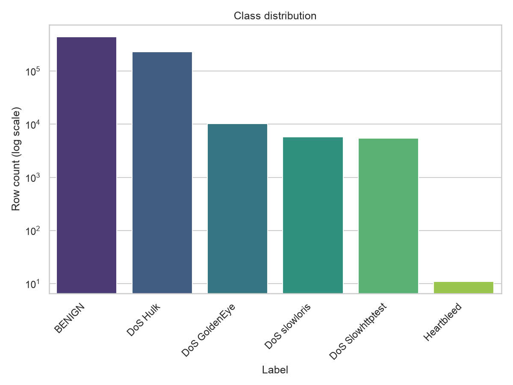
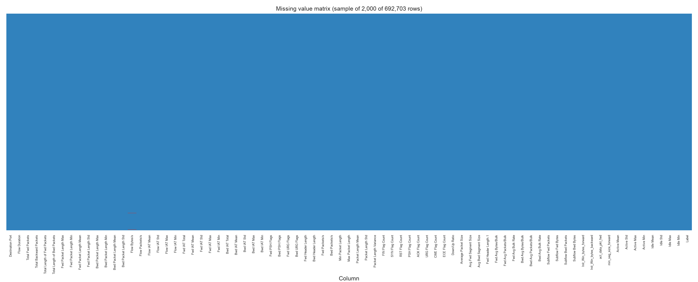
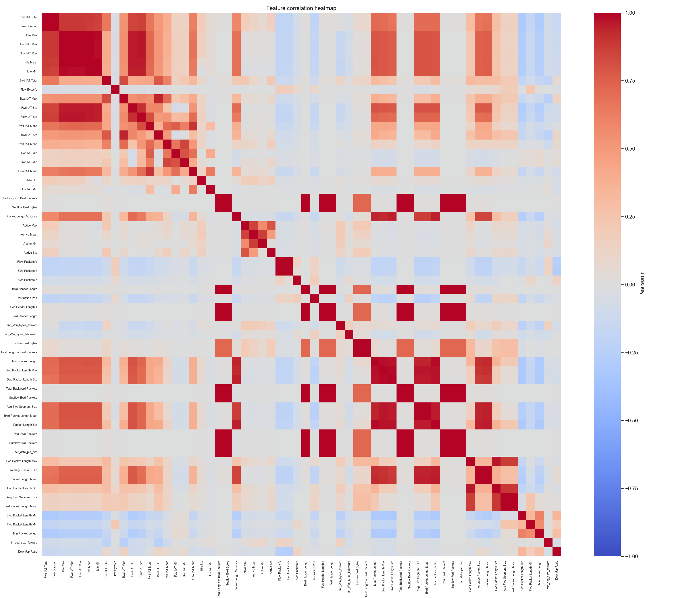
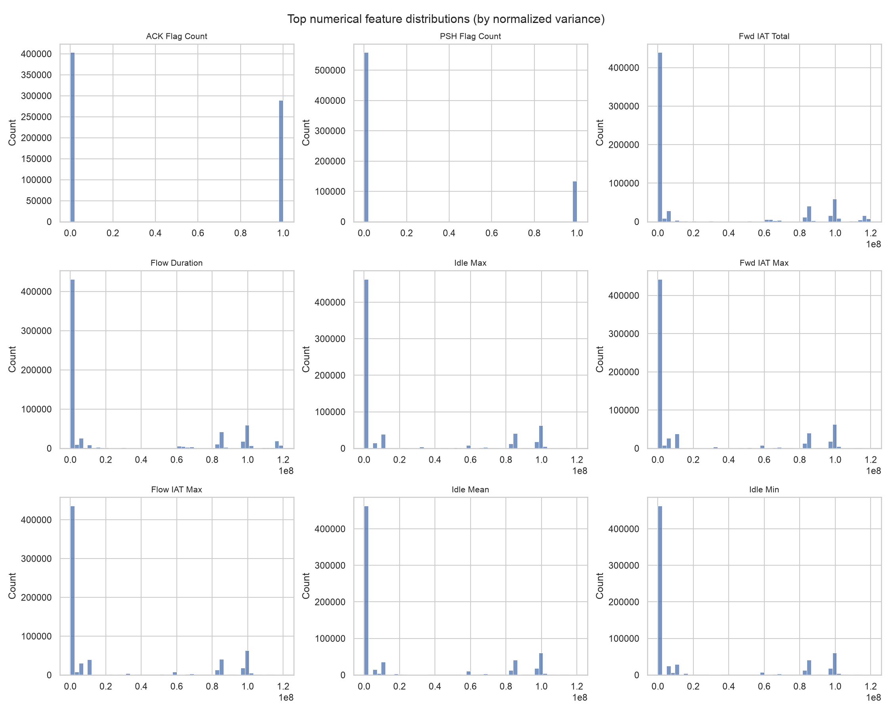

# CICIDS2017 Data Profile Report

**Dataset:** `Wednesday-workingHours.pcap_ISCX` (Wednesday-workingHours.pcap_ISCX.csv)  
**Rows:** 692,703  **Columns:** 79  **Memory usage:** 449.16 MB

This report is generated by `ml/data/report.py` and is strictly exploratory: the underlying dataset is never cleaned, modified, or used for training. Full numeric detail lives alongside this file in `data_profile.json`, `summary_statistics.csv`, and `correlation_pairs.csv`.

## Observed Data Quality Issues

- **Missing values**: 1 column(s) contain nulls.
  - `Flow Bytes/s`: 1,008 missing (0.1455%)
- **Infinite values**: 2 numeric column(s) contain ±Inf.
  - `Flow Packets/s`: 1,297 infinite value(s)
  - `Flow Bytes/s`: 289 infinite value(s)
  - These typically arise from rate features (e.g. bytes/s, packets/s) computed by dividing by a zero flow duration.
- **Duplicate rows**: 81,909 (11.8245% of all rows).
- **Constant columns** (zero information content): `Bwd PSH Flags`, `Fwd URG Flags`, `Bwd URG Flags`, `CWE Flag Count`, `Fwd Avg Bytes/Bulk`, `Fwd Avg Packets/Bulk`, `Fwd Avg Bulk Rate`, `Bwd Avg Bytes/Bulk`, `Bwd Avg Packets/Bulk`, `Bwd Avg Bulk Rate`
- **Low-variance columns** (normalized variance below threshold): `Total Fwd Packets`, `Total Backward Packets`, `Total Length of Fwd Packets`, `Total Length of Bwd Packets`, `Fwd Packet Length Max`, `Fwd Packet Length Min`, `Fwd Packet Length Mean`, `Fwd Packet Length Std`, `Bwd Packet Length Min`, `Flow Bytes/s`, `Flow Packets/s`, `Flow IAT Mean`, `Flow IAT Min`, `Fwd IAT Mean`, `Fwd IAT Min`, `Bwd IAT Mean`, `Bwd IAT Min`, `Fwd Header Length`, `Bwd Header Length`, `Bwd Packets/s`, `Min Packet Length`, `Packet Length Variance`, `RST Flag Count`, `ECE Flag Count`, `Down/Up Ratio`, `Avg Fwd Segment Size`, `Fwd Header Length.1`, `Subflow Fwd Packets`, `Subflow Fwd Bytes`, `Subflow Bwd Packets`, `Subflow Bwd Bytes`, `act_data_pkt_fwd`, `Active Mean`, `Active Std`, `Active Max`, `Active Min`, `Idle Std`
- **Highly correlated feature pairs**: 87 pair(s) at |r| ≥ threshold (full list in `correlation_pairs.csv`). Top 5:
  - `Total Fwd Packets` <-> `Subflow Fwd Packets`: r = 1.0
  - `Total Backward Packets` <-> `Subflow Bwd Packets`: r = 1.0
  - `Total Length of Fwd Packets` <-> `Subflow Fwd Bytes`: r = 1.0
  - `Total Length of Bwd Packets` <-> `Subflow Bwd Bytes`: r = 1.0
  - `Fwd Packet Length Mean` <-> `Avg Fwd Segment Size`: r = 1.0
- **Class imbalance**: 6 class(es); majority class `BENIGN` is 40,002.8x larger than minority class `Heartbleed`.

## Expected Preprocessing Steps

1. Drop constant columns (10) -- they carry no predictive signal and only add dimensionality.
2. Replace ±Inf in rate-derived columns (`Flow Bytes/s`, `Flow Packets/s`) with NaN, then apply the same missing-value strategy used for the rest of the dataset.
3. Impute or drop rows/columns with missing values, depending on how concentrated the missingness is per column (see `data_profile.json` for the per-column breakdown).
4. Deduplicate the 81,909 exact-duplicate rows before any train/test split, to avoid leakage between splits.
5. Review low-variance columns (`Total Fwd Packets`, `Total Backward Packets`, `Total Length of Fwd Packets`, `Total Length of Bwd Packets`, `Fwd Packet Length Max`, `Fwd Packet Length Min`, `Fwd Packet Length Mean`, `Fwd Packet Length Std`, `Bwd Packet Length Min`, `Flow Bytes/s`, `Flow Packets/s`, `Flow IAT Mean`, `Flow IAT Min`, `Fwd IAT Mean`, `Fwd IAT Min`, `Bwd IAT Mean`, `Bwd IAT Min`, `Fwd Header Length`, `Bwd Header Length`, `Bwd Packets/s`, `Min Packet Length`, `Packet Length Variance`, `RST Flag Count`, `ECE Flag Count`, `Down/Up Ratio`, `Avg Fwd Segment Size`, `Fwd Header Length.1`, `Subflow Fwd Packets`, `Subflow Fwd Bytes`, `Subflow Bwd Packets`, `Subflow Bwd Bytes`, `act_data_pkt_fwd`, `Active Mean`, `Active Std`, `Active Max`, `Active Min`, `Idle Std`) for removal -- they add little separability but do add training cost.
6. Reduce redundancy among highly correlated feature pairs (drop one from each pair, or apply dimensionality reduction) to limit multicollinearity.
7. Encode the categorical label column and scale/normalize numeric features -- flow features span very different units and magnitudes (durations in microseconds vs. byte/packet counts).
8. Address class imbalance (e.g. class weighting, oversampling minority attack classes, or stratified sampling) before training.

## Potential Modelling Challenges

- **Severe class imbalance** (40,002.8x majority/minority ratio): accuracy alone will be a misleading metric; rare attack classes risk being ignored by the model unless explicitly weighted or resampled.
- **Multicollinearity**: 87 feature pair(s) are highly correlated, which can destabilize linear/coefficient-based models and inflate feature-importance estimates for tree-based models.
- **Dimensionality vs. row count**: 79 columns over 692,703 rows (449.16 MB in memory) -- feature selection or dimensionality reduction may be needed to control training cost and overfitting risk.
- **Data integrity artifacts** (±Inf/NaN in rate-based features) must be resolved consistently between training and inference, or the serving pipeline will crash or silently diverge from what the model was trained on.
- **Generalization beyond this capture window**: CICIDS2017 reflects one lab's traffic and attack patterns over a fixed time window; models trained on it may not transfer to production traffic without further validation.

## Visualizations

### Class Distribution

### Missing Value Matrix

### Correlation Heatmap

### Top Numerical Feature Distributions

